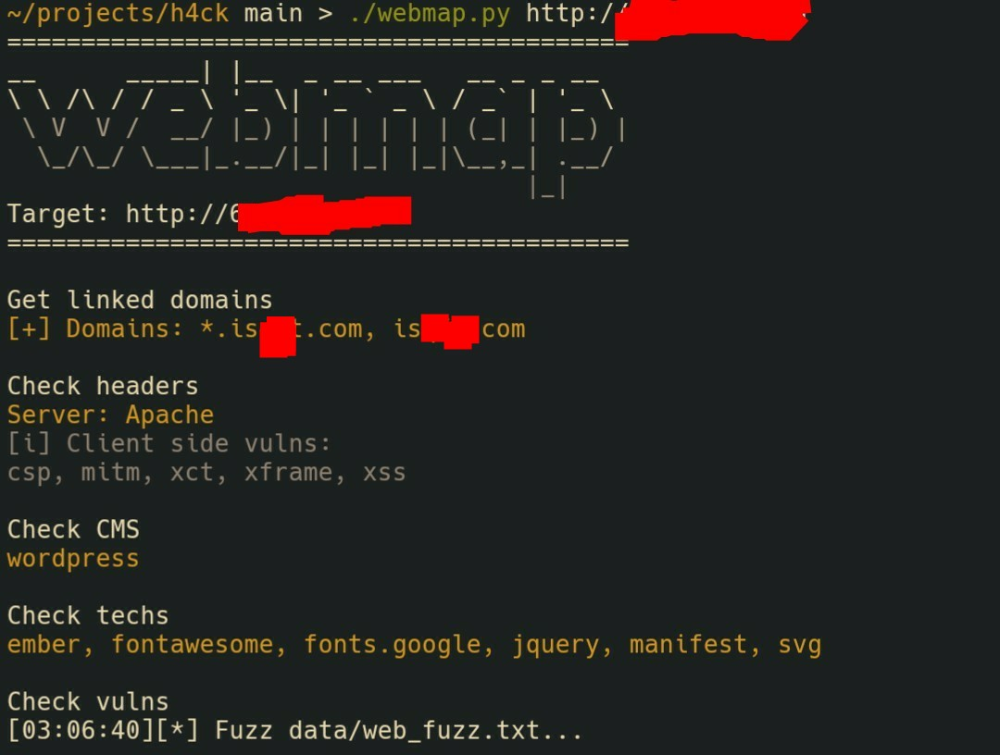
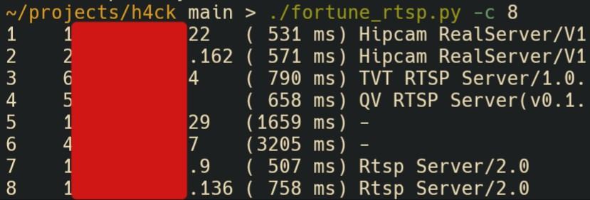

# h4ck

&laquo;Hacking&raquo; tools. WIP

|Tool|Purpose|
|---|---|
|fortune*| random IPs scanner/generator |
|netbat| hosts + ports scanner, supports host list (+CIDR) |
|rtsp_brute| fuzz&brute rtsp cameras |
|vpn| connect to VPN server using openvpn |
|webmap| Scan web application for CMS, used techs, vulns (file, dir fuzz) |

## Some screenshots

### webmap

### fortune_rtsp

## Precaution

:exclamation: Only for education purposes. Use at your own risk.
