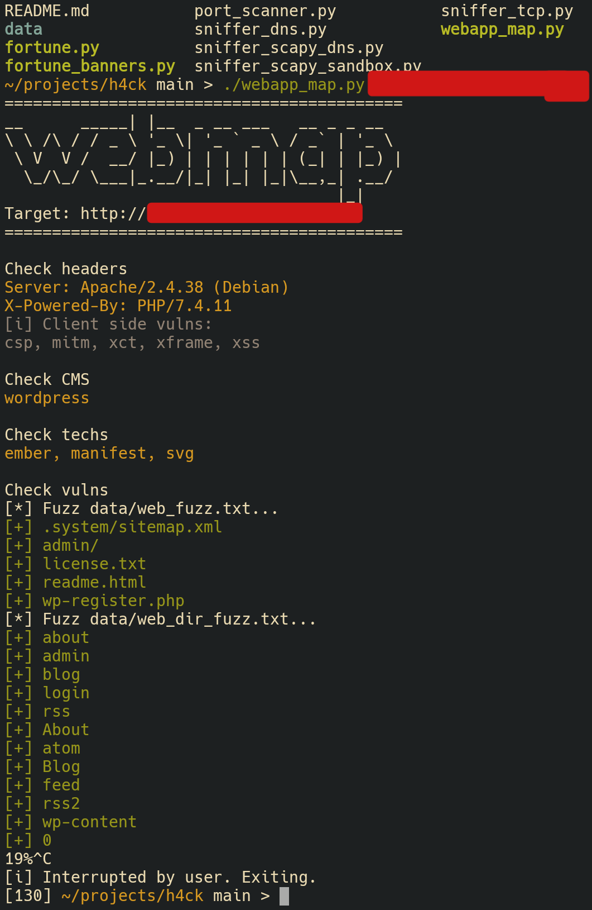

# h4ck

&laquo;Hacking&raquo; tools written by me.

`fortune*` -- random IPs scanner/generator  
`netbat` -- hosts + ports scaner, supports hostlist (+CIDR)  
`rtsp_brute` -- fuzz&brute rtsp cameras  
`webmap` -- Scan web application for CMS, used techs, vulns (file, dir fuzz)

:exclamation: Only for education purposes. Use at your own risk.

WIP =)

